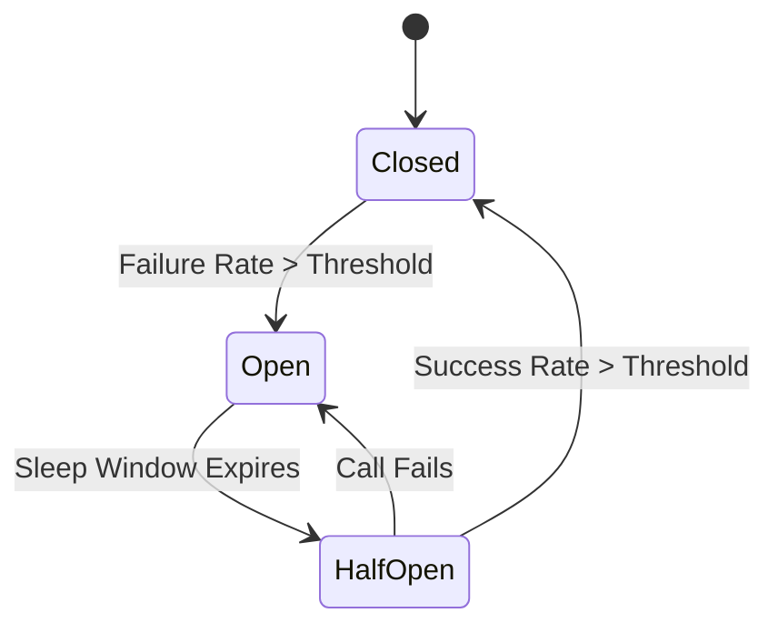

# Resiliency & Reliability Patterns

This guide covers core software patterns used to build fault-tolerant, resilient systems: Circuit Breakers, Exponential Backoff with Jitter, and the Bulkhead Pattern. It also includes Node.js implementations.

## Contents

- [The Circuit Breaker Pattern](#the-circuit-breaker-pattern)
- [Retries, Exponential Backoff, & Jitter](#retries-exponential-backoff--jitter)
- [The Bulkhead Pattern](#the-bulkhead-pattern)
- [JavaScript Implementation Examples](#javascript-implementation-examples)

---

## The Circuit Breaker Pattern

In a microservices architecture, a service makes remote calls to other services. If a downstream service is slow or failing, requests will back up, consume server resources (threads, memory), and cause a **cascading failure** across the entire system.

A **Circuit Breaker** acts as a protective wrapper around remote calls. It has three states:



* **Closed (Normal)**: Requests flow through. The breaker monitors failures. If failures stay below a threshold (e.g., <50% failure rate), it remains Closed.
* **Open (Tripped)**: The downstream service is failing. The circuit breaker trips Open. **All calls fail instantly** (returning fallback data or a fast error) without even hitting the network. This gives the downstream service time to recover.
* **Half-Open (Testing)**: After a "sleep window" (e.g., 10 seconds), the breaker transitions to Half-Open. It sends a few trial requests.
  * If they succeed, it assumes the service is healthy and transitions to **Closed**.
  * If any fail, it assumes the service is still down and trips back to **Open**.

---

## Retries, Exponential Backoff, & Jitter

When a network call fails due to a transient issue (brief glitch, network drop), retrying the call makes sense. However, retrying immediately can make things worse.

### 1. Exponential Backoff
Instead of retrying immediately, increase the delay exponentially after each failed attempt:
* Attempt 1: Fail -> wait 100ms
* Attempt 2: Fail -> wait 200ms
* Attempt 3: Fail -> wait 400ms
* Attempt 4: Fail -> wait 800ms

### 2. Jitter (Random Noise)
If a database recovers from a crash, and 10,000 idle client servers are programmed with standard exponential backoff, they will all retry at the exact same millisecond:
* 100ms later: 10,000 retries (server crashes again)
* 200ms later: 10,000 retries (server crashes again)

Adding **Jitter** introduces random delay variance to spread retries evenly:
$$\text{Delay} = \text{random}(0, \text{Base} \times 2^{\text{attempt}})$$
Instead of all retrying at 400ms, clients will scatter their retries randomly between 0 and 800ms, smoothing the traffic spike.

---

## The Bulkhead Pattern

Named after the partition walls in a ship's hull that prevent water from filling the entire ship if a leak occurs.

In software, the **Bulkhead Pattern** isolates resources (like thread pools, CPU, connection pools, or memory) into bounded compartments:
* *Without Bulkheads*: If your app uses a single thread pool for all routes, and the `/external-payment` API becomes extremely slow, all threads will get blocked waiting for payments. Users trying to load the homepage `/` will get blocked too, crashing the entire site.
* *With Bulkheads*: Allocate 80 threads for `/homepage` and 20 threads for `/external-payment`. If the payment gateway fails, only those 20 threads get blocked. The remaining 80 threads keep servicing the homepage normally.

---

## JavaScript Implementation Examples

### 1. Retries with Exponential Backoff and Jitter
Here is a reusable JavaScript utility function to call an API with smart retry logic:

```javascript
/**
 * Executes a function with exponential backoff retry and jitter.
 */
async function retryWithBackoff(fn, retries = 5, delay = 100, maxDelay = 3000) {
  for (let attempt = 1; attempt <= retries; attempt++) {
    try {
      return await fn(); // Attempt to execute task
    } catch (error) {
      if (attempt === retries) {
        throw new Error(`Failed after ${retries} attempts. Original error: ${error.message}`);
      }

      // Calculate exponential backoff: delay * 2^(attempt - 1)
      const backoff = Math.min(maxDelay, delay * Math.pow(2, attempt - 1));
      
      // Add Full Jitter (random duration between 0 and backoff)
      const jitter = Math.random() * backoff;

      console.warn(`[Attempt ${attempt} Failed]: Retrying in ${Math.round(jitter)}ms...`);
      await new Promise(resolve => setTimeout(resolve, jitter));
    }
  }
}

// Example usage:
const mockFailingApi = async () => {
  if (Math.random() > 0.8) return "Data fetched!";
  throw new Error("Network timeout");
};

retryWithBackoff(mockFailingApi)
  .then(res => console.log('Success:', res))
  .catch(err => console.error('Error:', err.message));
```

### 2. A Basic Circuit Breaker State Machine
Here is a simple class to demonstrate the inner logic of a Circuit Breaker:

```javascript
class CircuitBreaker {
  constructor(requestFunction, options = {}) {
    this.requestFunction = requestFunction;
    this.failureThreshold = options.failureThreshold || 3; // number of failures before tripping
    this.sleepWindow = options.sleepWindow || 5000; // ms to stay open before half-opening
    
    this.state = 'CLOSED';
    this.failureCount = 0;
    this.nextAttempt = Date.now();
  }

  async execute(...args) {
    // 1. Check if circuit is OPEN
    if (this.state === 'OPEN') {
      if (Date.now() > this.nextAttempt) {
        this.state = 'HALF-OPEN';
        console.log('Circuit is HALF-OPEN. Sending test request...');
      } else {
        throw new Error('Circuit is OPEN. Request blocked.'); // Fast Failure
      }
    }

    try {
      // 2. Execute target action
      const result = await this.requestFunction(...args);
      this.success();
      return result;
    } catch (error) {
      this.failure();
      throw error;
    }
  }

  success() {
    this.failureCount = 0;
    this.state = 'CLOSED';
  }

  failure() {
    this.failureCount++;
    if (this.failureCount >= this.failureThreshold || this.state === 'HALF-OPEN') {
      this.state = 'OPEN';
      this.nextAttempt = Date.now() + this.sleepWindow;
      console.warn(`Circuit TRIPPED to OPEN. Next retry allowed at: ${new Date(this.nextAttempt).toLocaleTimeString()}`);
    }
  }
}
```
