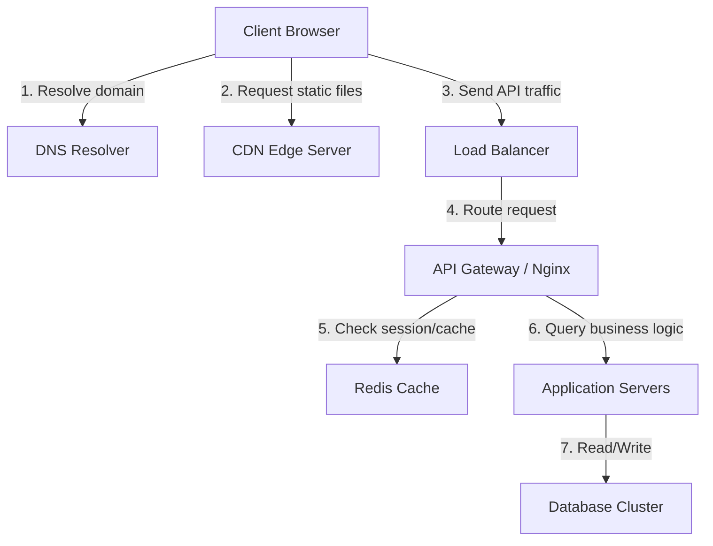

# System Design Interview Master Guide & Core Architectures

This guide covers the high-level infrastructure components (DNS, CDN, Caching, DB Selection) followed by detailed, step-by-step blueprints for the most asked system design questions.

---

## Part 1: High-Level Infrastructure Fundamentals



### 1. DNS (Domain Name System) Architecture
DNS resolves human-readable domain names (e.g., `google.com`) into computer-routable IP addresses.

#### The DNS Query Flow (Recursive Resolution):
1. **Browser Cache / OS Cache**: Checks if the IP is already cached locally.
2. **Recursive Resolver (ISP / Google 8.8.8.8)**: If not locally cached, the browser queries the resolver.
3. **Root Name Server (`.`)**: The resolver asks the Root server, which redirects to the TLD name server.
4. **TLD (Top-Level Domain) Server (`.com`, `.net`)**: Redirects the resolver to the Authoritative Name Server of the domain.
5. **Authoritative Name Server**: Returns the final IP address (A / AAAA record) to the resolver, which caches it and returns it to the client.

#### DNS Routing Policies (for Latency & Scaling):
* **Geolocation Routing**: Directs users to the closest data center based on their country.
* **Latency-Based Routing**: Measures round-trip time (RTT) and sends traffic to the fastest server pool.
* **Weighted Round-Robin**: Splits traffic (e.g., 90% to Server Pool A, 10% to Server Pool B for canary testing).

---

### 2. CDN (Content Delivery Network) Architecture
A CDN is a distributed network of proxy servers called **Edge Servers** or **PoPs (Points of Presence)** located globally. They cache static files (images, JS, HTML, videos) physically close to users to reduce latency.

```text
               /---> [Edge Server Europe] ---> [Client EU]
[Origin Server] ---> [Edge Server USA]    ---> [Client US]
               \---> [Edge Server Asia]   ---> [Client Asia]
```

#### CDN Caching Strategies:
* **Pull CDN (Caching on Demand)**:
  * When a user requests an asset, the Edge Server checks its local cache.
  * On a cache miss, the Edge pulls the asset from the **Origin Server** (your app servers), caches it locally, and returns it to the user.
  * *Best for*: Highly dynamic websites or large catalogs of assets.
* **Push CDN (Preloading)**:
  * The application pushes new assets to the CDN Edge servers proactively whenever content changes.
  * *Best for*: Static websites, software releases, or marketing campaigns where content changes infrequently but expects heavy immediate traffic.

#### Latency Reduction:
* **Anycast Routing**: Directs the client to the nearest CDN Edge server using a single IP address routed geographically at the network layer (BGP).
* **TLS Handshake Offloading**: The SSL/TLS handshake is terminated at the CDN edge rather than the origin server, saving network round trips.

---

### 3. Caching Levels & Types

Caching is applied at multiple levels in a scale-out architecture:

1. **Client / Browser Caching**: HTTP headers (`Cache-Control`, `ETag`) prevent the browser from requesting unchanged static resources.
2. **Edge / CDN Caching**: Caches static assets at network-level edge servers.
3. **Reverse Proxy Caching (Nginx / Varnish)**: Caches entire HTTP responses in front of application servers.
4. **Application/Memory Caching (Redis / Memcached)**: Caches database queries, sessions, or computed objects in memory.
5. **Database Cache**: Database engines (PostgreSQL shared buffers, InnoDB buffer pool) store hot index and row blocks in RAM.

---

### 4. Database Selection Blueprint (SQL vs. NoSQL)

One of the most critical design decisions in interviews is choosing the right storage.

#### A. When to Choose SQL (Relational Databases)
* *Examples*: PostgreSQL, MySQL.
* **Key Characteristics**: Schema-on-write, tabular relations, ACID transaction guarantees.
* **Choose SQL when**:
  1. **Transactional Integrity**: You need strict consistency (e.g., banking transactions, e-commerce checkout).
  2. **Complex Relationships**: Your data models have complex many-to-many relationships requiring heavy `JOIN` operations.
  3. **Structured Schemas**: The data structure is clear, stable, and changes infrequently.

#### B. When to Choose NoSQL (Non-Relational Databases)
* *Examples*: DynamoDB, Cassandra, MongoDB.
* **Key Characteristics**: Schema-on-read, horizontal scaling, eventual consistency.
* **Choose NoSQL when**:
  1. **Horizontal Scalability**: You need to scale reads/writes across multiple servers easily without complex database sharding.
  2. **Simple Access Patterns**: You query data by a single partition key (e.g., `user_id` or `short_code`) without needing complex table joins.
  3. **High Write Throughput**: Ingesting massive data streams (logs, sensor telemetry, user clickstreams).

---

### Case Study: SQL vs. NoSQL for a URL Shortener (TinyURL)

In a URL shortener system design, you are mapping a 7-character `shortCode` to a `longUrl`.

#### If we choose SQL (e.g., PostgreSQL):
* *Pros*: Simple setup, schema is clear.
* *Cons*: 
  * Scaling writes requires manual database sharding (partitioning rows by ranges of the short code across different servers).
  * Sharding SQL adds application complexity and can cause hot-key bottlenecks.

#### If we choose NoSQL (e.g., DynamoDB or Cassandra) - RECOMMENDED:
* **Why it fits perfectly**:
  1. **Simple Key-Value Access**: The query is always `GET shortCode` -> returns `longUrl`. There are **zero joins** or relational connections.
  2. **Horizontal Partitioning**: NoSQL databases natively partition data automatically based on the partition key hash (e.g., hashing the `shortCode`).
  3. **Low Write Latency**: Write-intensive scaling is managed out-of-the-box by NoSQL clusters.
  4. **Cost and Maintenance**: Managed NoSQL (like DynamoDB) scales up and down based on reads/writes without needing complex server maintenance.

---

## Part 2: Top 10 System Design Questions (Step-by-Step Blueprints)

---

### 1. Design a URL Shortener (TinyURL)

#### Step 1: Requirements & Scope
* **Functional**: Shorten long URL $\rightarrow$ 7-character Base62 string. Redirecting via the short URL $\rightarrow$ 302 redirect to the original URL.
* **Non-Functional**: High availability, minimal redirection latency (<50ms).
* **Scale Calculations**: 100M URLs created/day. 
  * Writes QPS: $100\text{M} / 86400 \approx 1,160\text{ writes/sec}$.
  * Read QPS (ratio 10:1): $11,600\text{ reads/sec}$.
  * Storage (5 years): $100\text{M} \times 5 \text{ years} \times 365 \text{ days} \times 500\text{ bytes} \approx 90\text{ Terabytes}$.

#### Step 2: API Contract Design
* `POST /api/v1/shorten` $\rightarrow$ Request: `{"longUrl": "..."}` $\rightarrow$ Response: `{"shortUrl": "..."}`
* `GET /{shortCode}` $\rightarrow$ Redirects user (302 Found) to the long URL.

#### Step 3: Database Selection
* **NoSQL Key-Value (DynamoDB)**: Key: `short_code` (Partition Key), Value: `long_url`.
* **Reason**: Scaling 90TB of simple key-value records with zero joins is significantly easier with NoSQL partitioning than SQL sharding.

#### Step 4: High-Level Architecture
```text
[Client] ---> [DNS] ---> [Nginx Load Balancer] ---> [Web Application Servers]
                                                       |         |
                                         (Read Cache)  v         v  (Write DB)
                                                  [Redis]     [DynamoDB]
```

#### Step 5: Detailed Design: Unique ID Generation
To generate the 7-character code without collisions:
* Use a distributed counter generator (like **Twitter Snowflake** or a **Zookeeper Range Coordinator**).
* Zookeeper issues ranges of IDs (e.g., Server A gets `1` to `1,000,000`, Server B gets `1,000,001` to `2,000,000`).
* The app server takes the integer ID and encodes it into a Base62 string (`[a-zA-Z0-9]`), ensuring absolute uniqueness with zero database collision checks.

---

### 2. Design a Rate Limiter

#### Step 1: Requirements & Scope
* **Functional**: Limit API requests per user (e.g., max 100 requests/min).
* **Non-Functional**: Sub-millisecond latency overhead, distributed scalability.

#### Step 2: Algorithm Comparison
* **Token Bucket**: Stores `tokens` and `last_updated_time`. Allows traffic bursts.
* **Sliding Window Counter**: Highly accurate, low memory. Evaluates requests based on: `current_window_count + previous_window_count * overlap_percentage`.

#### Step 3: High-Level & Detailed Design
The Rate Limiter runs as a middleware at the **API Gateway** layer:
1. Client request hits API Gateway.
2. Gateway extracts client identifier (IP or User ID).
3. Gateway runs an atomic **Redis Lua script** evaluating the Token Bucket or Sliding Window logic.
4. If tokens > 0, request is forwarded to App Servers. If not, returns `429 Too Many Requests`.

```text
[Client] ---> [API Gateway (Limiter Middleware)] ---> [App Servers]
                        |
            (Atomic Lua script query)
                        v
                 [Redis Cache]
```

---

### 3. Design an Instant Messaging App (WhatsApp/Slack)

#### Step 1: Requirements & Scope
* **Functional**: One-on-one chat, delivery receipts (sent, delivered, read), user online status.
* **Non-Functional**: Real-time delivery (<100ms), no message loss.

#### Step 2: Communication Protocol
* **WebSockets**: Establishes a persistent TCP connection between client and server, allowing bi-directional streaming.

#### Step 3: High-Level Architecture
* **WebSocket Gateways**: Stateful servers that hold open TCP connections for online users.
* **Presence Service**: Keeps track of user online status using a fast heartbeat in Redis.
* **Message Broker / MQ**: Distributes messages between gateway nodes.

```text
[User A] ---> [WebSocket Gateway 1] ---> [Message Broker] ---> [WebSocket Gateway 2] ---> [User B]
                                              |
                                              v (Write)
                                       [Cassandra DB]
```

#### Step 4: Database Selection
* **Cassandra (Wide-Column Store)**: Perfect for chat histories. Partition Key: `chat_id`, Clustering Key: `message_id` (timeuuid).
* **Reason**: Cassandra supports extremely high-write throughput and retrieves chat histories sequentially from disk in milliseconds.

---

### 4. Design a Video Streaming Service (YouTube/Netflix)

#### Step 1: Requirements & Scope
* **Functional**: Upload video, stream video at variable bitrates, view counter.
* **Non-Functional**: Highly available, low buffering latency.

#### Step 2: High-Level Architecture
```text
[User Upload] ---> [API Gateway] ---> [Raw S3 Bucket] ---> [Transcoding Workers] ---> [CDN S3 Bucket]
                                                                                            |
[User Stream] <--- [CDN Edge (Anycast)] <---------------------------------------------------+
```

#### Step 3: Component Deep-Dive (Transcoding & Streaming)
* **File Chunking**: Raw videos are split into 4-second chunks (`.ts` or `.m4s`).
* **Transcoding Engine**: Converts chunks into different formats (HLS, DASH) and multiple resolutions (1080p, 720p, 480p) asynchronously using a queue.
* **Adaptive Bitrate Streaming (ABR)**: The client video player dynamically shifts resolutions between chunks depending on the user's changing internet speed.

#### Step 4: Storage & CDN Strategy
* **BLOB Storage (S3)**: Houses all static video chunks.
* **CDN (Pull Strategy)**: Caches hot chunks at edge servers. Unpopular (long-tail) chunks are fetched from S3 on demand.

---

### 5. Design a Notification System

#### Step 1: Requirements & Scope
* **Functional**: Send Email, SMS, and Mobile Push Notifications.
* **Non-Functional**: Highly reliable (at-least-once), rate-limiting.

#### Step 2: High-Level Architecture
Decouple services using **Message Queues**:
```text
[App Server] ---> [API Gateway] ---> [Notification Service]
                                            |
                                            v (Push to Queues)
                                   [SMS / Push / Email MQ]
                                            |
                                            v (Consume)
                                    [Worker Instances] ---> [APNs / Twilio / SendGrid]
```

#### Step 3: Key Operations
* **Deduplication**: Store `notification_uuid` in Redis with a 24-hour TTL. If a duplicate comes in, reject it.
* **Rate Limiting**: Ensure users aren't spammed with too many notifications (e.g. max 3 marketing notifications/day).

---

### 6. Design an E-Commerce Checkout / Ticket Booking System

#### Step 1: Requirements & Scope
* **Functional**: Reserve seat/item, process payment, confirm order.
* **Non-Functional**: Strict Consistency (no double booking).

#### Step 2: Database Selection
* **SQL (PostgreSQL / MySQL)**: Strict transaction ACID requirements to ensure reservation and payment commit atomically or rollback cleanly.

#### Step 3: Concurrency Control (Preventing Double Booking)
* **Distributed Locking (Redis/Redlock)**:
  * When a user selects a seat: `SET seat:123 "locked" EX 600 NX` (Locks seat for 10 mins).
  * If successful, user proceeds to checkout.
  * If payment succeeds, write transaction to Postgres, commit, and delete the Redis lock.
  * If payment fails or 10 mins expires, lock is cleared automatically, releasing the seat.

---

### 7. Design a News Feed System (Twitter/Facebook)

#### Step 1: Requirements & Scope
* **Functional**: Post update, view news feed, follow users.
* **Non-Functional**: Low latency feed generation (<200ms).

#### Step 2: Hybrid Fan-out Strategy
* **Normal Users**: Use the **Push Model (Fan-out on Write)**. When they post, write the post ID to their followers' cached timelines in Redis.
* **Celebrities (Hot Keys)**: Use the **Pull Model (Fan-out on Read)**. Do not push celebrity posts to millions of follower caches. Instead, when a follower loads their feed, merge the celebrity's posts on-the-fly.

```text
[Post Creation] ---> [Fan-out Worker] ---> [Update follower feeds in Redis]
[Feed Request]  ---> [Merge Worker]   ---> [Read follower feed + Fetch Celeb posts on-read]
```

---

### 8. Design a Distributed Cache (Redis-like)

#### Step 1: Requirements & Scope
* **Functional**: Get/Set keys, TTL eviction.
* **Non-Functional**: Sub-millisecond latency, horizontal scalability.

#### Step 2: Sharding & Consistency Ring
* **Consistent Hashing**: Keys and servers are mapped to a 360-degree virtual ring. A key is routed to the nearest cache server clockwise.
* **Virtual Nodes**: To prevent uneven key distribution (hot spots), map multiple virtual nodes per physical cache server on the ring.

```text
         Cache Node A (V1)
       /                   \
  Key 1                     Cache Node B (V1)
    |                          |
  Key 3                     Key 2
       \                   /
         Cache Node A (V2)
```

---

### 9. Design a Ride-Hailing Service (Uber/Lyft)

#### Step 1: Requirements & Scope
* **Functional**: Drivers share location; match rider with closest driver.
* **Non-Functional**: High-frequency real-time updates.

#### Step 2: Spatial Indexing
* **Uber H3 (Hexagonal Grid)**: Divides the Earth into hierarchical hexagons. 
* Drivers' coordinates are updated in **Redis Geospatial Indexes** (`GEOADD`), storing longitude/latitude in a sorted set mapped by H3 cells.
* Finding close drivers: Query `GEORADIUS` around the rider's coordinate.

---

### 10. Design a Web Crawler

#### Step 1: Requirements & Scope
* **Functional**: Crawl seed URLs, parse HTML, extract links, index contents.
* **Non-Functional**: Politeness (don't DDOS sites), scalability.

#### Step 2: Core Components
* **URL Frontier**: The link repository queue.
* **Politeness Engine**: Routes requests to target domains through dedicated queues with delays, checking `robots.txt` first.
* **Deduplication Engine**: Uses **Bloom Filters** to check if a URL has already been visited, and **SimHash** to check if page content is duplicate.
