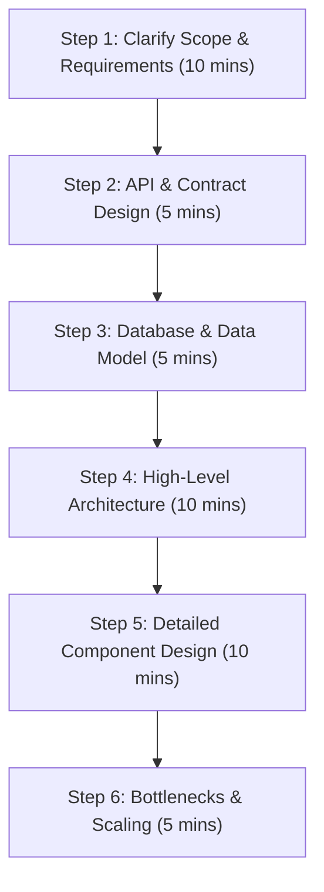

# System Design Interview Master Guide

This guide covers the general step-by-step framework to handle any System Design interview, followed by blueprints for the **10 most frequently asked system design questions**.

## Contents

- [The System Design Interview Template (Step-by-Step Flow)](#the-system-design-interview-template-step-by-step-flow)
- [Top 10 System Design Questions](#top-10-system-design-questions)
  1. [Design a URL Shortener (TinyURL)](#1-design-a-url-shortener-tinyurl)
  2. [Design a Rate Limiter](#2-design-a-rate-limiter)
  3. [Design an Instant Messaging App (WhatsApp/Slack)](#3-design-an-instant-messaging-app-whatsappslack)
  4. [Design a Video Streaming Service (YouTube/Netflix)](#4-design-a-video-streaming-service-youtubenetflix)
  5. [Design a Notification System](#5-design-a-notification-system)
  6. [Design an E-Commerce Checkout / Ticket Booking System](#6-design-an-e-commerce-checkout--ticket-booking-system)
  7. [Design a News Feed System (Twitter/Facebook)](#7-design-a-news-feed-system-twitterfacebook)
  8. [Design a Distributed Cache (Redis-like)](#8-design-a-distributed-cache-redis-like)
  9. [Design a Ride-Hailing Service (Uber/Lyft)](#9-design-a-ride-hailing-service-uberlyft)
  10. [Design a Web Crawler](#10-design-a-web-crawler)

---

## The System Design Interview Template (Step-by-Step Flow)

In an interview, you have about 45 minutes. The interviewer wants to see *how* you think. Do not start writing code or drawing boxes immediately. Follow this structured flow:



### Step 1: Clarify Scope & Requirements (10 mins)
* **Functional Requirements**: What *must* the system do? (e.g., "User can post a tweet, user can view newsfeed"). Focus on the top 2-3 core features.
* **Non-Functional Requirements**: 
  * High Availability vs Strong Consistency (CAP Theorem).
  * Latency requirements (e.g., chat must be <100ms).
  * Scalability (How many Daily Active Users (DAU)? Let's assume 100 Million).
* **Back-of-the-envelope calculations**: Estimate read/write QPS (Queries Per Second), network bandwidth, and storage requirements over 5 years.

### Step 2: API & Contract Design (5 mins)
Define the communication interface between client and server. Write out the HTTP method, endpoint paths, request parameters, and response JSON:
* `POST /v1/tweets` -> `{"text": "Hello World"}` -> returns `{"tweet_id": "abc123"}`

### Step 3: Database & Data Model (5 mins)
* Choose **SQL vs NoSQL** and explain *why*.
* Define the primary keys, foreign keys, indexes, and schemas.
* Note data access patterns (heavy reads vs heavy writes).

### Step 4: High-Level Architecture (10 mins)
Draw the big picture. Start from the client and draw components downstream:
* **Client** -> **DNS** -> **CDN** (static assets) -> **Load Balancer** -> **API Gateway** -> **App Servers** -> **Cache** -> **Database**.
* Introduce message queues for asynchronous background tasks.

### Step 5: Detailed Component Design (10 mins)
Zoom in on the unique hard problems of the prompt (e.g., "How do we generate unique IDs without collisions?", "How does the geo-spatial query find nearby drivers in <100ms?").

### Step 6: Bottlenecks & Scaling (5 mins)
* **Databases**: Partitioning/Sharding (by key or range), replication (Master-Slave), read replicas.
* **Failure Handling**: Circuit breakers, failover strategies, Rate Limiting.
* **Caching**: Cache invalidation (LRU/LFU), caching at CDN, API, and Database levels.

---

## Top 10 System Design Questions

---

### 1. Design a URL Shortener (TinyURL)

#### A. Core Requirements
* **Functional**: Long URL in -> Short URL out. Accessing short URL redirects to long URL. Custom aliases allowed.
* **Non-Functional**: Highly available, minimal redirection latency (<50ms), short URLs should be unguessable.

#### B. API Design
* `POST /api/v1/shorten`
  * Request: `{"longUrl": "https://example.com/very-long-path", "customAlias": "optional"}`
  * Response: `{"shortUrl": "https://tiny.url/xyz789"}`
* `GET /{shortCode}` -> Returns `302 Found` (Redirection) with `Location` header.

#### C. Database Schema (NoSQL / Key-Value)
Since mappings are simple key-value pairs (`shortCode -> longUrl`), a NoSQL Key-Value store (like DynamoDB or MongoDB) or SQL with a unique index is suitable.
* Table `url_mapping`: `short_code` (PK, string), `long_url` (string), `created_at` (timestamp), `expires_at` (timestamp).

#### D. Detailed Design & Key Challenge (Short Code Generation)
How to generate a unique 7-character code (Base62: `a-z, A-Z, 0-9`)?
1. **Hashing (MD5/SHA-256)**: Take hash of long URL, take first 7 characters.
   * *Problem*: Hash collisions require checking database, which is slow.
2. **Range Keeper / Unique ID Generator (Recommended)**:
   * Use a distributed ID generator (like **Snowflake** or a **Zookeeper** central counter) to generate a unique 64-bit integer ID.
   * Convert that base-10 ID to Base62. (e.g., ID `10,000,000` becomes `aBc97`).
   * *Benefit*: Guarantees zero collisions, extremely fast.

#### E. Bottlenecks & Scaling
* **Read Heavy System**: redirectional queries are 100x more common than writes. Cache the hot mappings using Redis.
* **Caching Strategy**: Cache the most popular mappings (LRU eviction).

---

### 2. Design a Rate Limiter

#### A. Core Requirements
* **Functional**: Limit requests per user/IP (e.g., max 100 requests/minute). Return `429 Too Many Requests`.
* **Non-Functional**: Low latency overhead (<2ms), low memory footprint, distributed support.

#### B. API Design
Runs as a middleware/filter at the API Gateway level before requests reach the app servers.

#### C. Algorithms (The core discussion point)
* **Token Bucket (Recommended)**: A bucket has a fixed capacity and fills with tokens at a constant rate. Each request costs a token. Easy to implement, handles bursts.
* **Leaky Bucket**: Requests enter a queue and leave at a constant processing rate. Smooths out traffic bursts.
* **Sliding Window Log**: Stores timestamps of all requests in Redis sorted sets. Highly accurate but memory-intensive.
* **Sliding Window Counter**: Combines counter from previous window and current window. Low memory, highly performant.

#### D. Distributed Architecture
Use **Redis** to keep track of user counters/tokens centrally so multiple app servers can share the state.
```text
[Client] ---> [API Gateway / Rate Limiter Middleware] ---> [App Servers]
                            |
                     (Check Tokens/TTL)
                            v
                      [Redis Cache]
```

#### E. Bottlenecks & Scaling
* **Race Conditions**: Two concurrent requests check Redis at the exact same millisecond.
  * *Solution*: Use **Redis Lua Scripts** or Redis transactions (`MULTI`/`EXEC`) to make the check-and-increment operations atomic.

---

### 3. Design an Instant Messaging App (WhatsApp/Slack)

#### A. Core Requirements
* **Functional**: One-on-one chat, group chat, delivery/read receipts, online/offline status.
* **Non-Functional**: Real-time delivery (<100ms), reliable delivery (no lost messages), offline delivery support.

#### B. Protocols
* **WebSockets**: Bi-directional, persistent TCP connection. Ideal for instant chat.
* **HTTP Long Polling**: Fallback if WebSockets are blocked by firewalls.

#### C. High-Level Architecture
```text
[Sender Client] 
     | (WebSocket)
     v
[WebSocket Gateway Server] ---> [Message Service] ---> [Database (Cassandra)]
                                      |
                                      +---> [Presence Service] (Online status)
                                      |
[Recipient Client] <------------------+ (If online, push via WebSocket)
```

#### D. Database & Storage Strategy
Chat requires high-write throughput and fast retrieval of historical messages in chronological order.
* **Wide-Column Store (Cassandra/ScyllaDB)**: Perfect because partition key can be `chat_id` and clustering key can be `message_id` (chronological). Extremely scalable.
* **Metadata Database (PostgreSQL)**: To store user profiles, friendships, and group configurations.

#### E. Bottlenecks & Scaling
* **Offline Message Delivery**: If the receiver is offline, store the message in the DB. When they reconnect, the gateway pushes all unread messages.
* **Presence Service**: How to track if 100M users are online? Use a heart-beat mechanism updating a Redis key-value store with an expiration TTL of 30 seconds.

---

### 4. Design a Video Streaming Service (YouTube/Netflix)

#### A. Core Requirements
* **Functional**: Upload video, stream video at multiple resolutions, search videos, write comments.
* **Non-Functional**: Highly available, low buffering latency, scalability for huge file storage.

#### B. High-Level Architecture (Split into two paths)
1. **Upload Path (Write Path)**:
   * Upload Raw Video -> File Chunking -> **Transcoding Service** (converts raw file into formats like HLS/DASH and resolutions like 1080p, 720p) -> Store in S3.
2. **Streaming Path (Read Path)**:
   * Client requests video stream metadata -> Plays chunks from the nearest **CDN (Content Delivery Network)**.

```text
[Upload Client] ---> [Web Server] ---> [MQ] ---> [Transcoder] ---> [S3 Storage]
                                                                        |
[Streaming Client] <--- [CDN (Edge Cache)] <----------------------------+
```

#### C. Database Schema
* **Relational DB (PostgreSQL)**: For video metadata (titles, descriptions, user subscriptions, views).
* **BLOB Storage (Amazon S3 / Google Cloud Storage)**: For actual video chunks.

#### D. Key Technologies
* **HLS (HTTP Live Streaming) / MPEG-DASH**: Protocol that dynamically adjusts video quality based on the user's internet speed.
* **CDN (Content Delivery Network)**: Distributes video files to servers close to the user physically.

#### E. Bottlenecks & Scaling
* **Bandwidth Costs**: CDNs are expensive. Cache only the popular videos on CDNs. Long-tail (unpopular) videos are fetched directly from primary storage (S3) on demand.

---

### 5. Design a Notification System

#### A. Core Requirements
* **Functional**: Send notifications over SMS, Email, and Mobile Push. Support priority levels.
* **Non-Functional**: Highly reliable (at-least-once delivery), highly scalable (millions/day), rate-limiting notifications.

#### B. API Design
* `POST /v1/notifications`
  * Request: `{"recipient_id": "usr_99", "type": "EMAIL", "content": "Your package has shipped."}`

#### C. Architecture (Decoupled with Message Queues)
```text
[App Server] ---> [API Gateway / Rate Limiter] ---> [Notification Service]
                                                           |
                                                (Write to DB & Push to MQ)
                                                           v
                                                     [Message Queue]
                                                           |
                                                           v
                                                  [Worker Instances]
                                                           |
                                             (Call Third Party APIs)
                                             /          |          \
                                        [APNs/FCM]   [Twilio]   [Sendgrid]
                                         (Mobile)     (SMS)      (Email)
```

#### D. Key Design Elements
* **Third-Party Providers**: APNs (Apple Push Notification service), FCM (Firebase Cloud Messaging), Twilio (SMS), SendGrid (Email).
* **Message Queues**: Decoupling prevents slow third-party services from blocking internal microservices. Use separate queues for SMS, Email, and Push to prevent traffic from one delaying another.

#### E. Bottlenecks & Deduplication
* **Deduplication Mechanism**: Use a cache (Redis) with a TTL storing `notification_hash` to identify and discard duplicate requests submitted within a short window.

---

### 6. Design an E-Commerce Checkout / Ticket Booking System

#### A. Core Requirements
* **Functional**: View items/seats, place order, hold tickets temporarily, complete payment.
* **Non-Functional**: **Strictly Consistent** (no double booking), high throughput during flash sales.

#### B. Concurrency Handling (The Core Problem)
How to prevent two users from booking the exact same seat simultaneously?
1. **Pessimistic Locking (Database Level)**:
   * Use SQL `SELECT ... FOR UPDATE`.
   * Locks the row during the checkout transaction. 
   * *Cons*: Can cause database deadlocks and limits concurrency.
2. **Distributed Locking (Redis/Redlock) - Recommended**:
   * When a user selects a seat, set a key in Redis: `SET seat_123 "locked" EX 600 NX`.
   * Holds the seat for 10 minutes. If the user pays, write to the database and clear the lock. If they don't, the lock expires automatically.
3. **Optimistic Locking (Version Numbers)**:
   * Keep a `version` column in the database: `UPDATE seats SET status = 'booked', version = version + 1 WHERE id = 123 AND version = 5`.
   * Perfect when contention is low.

#### C. Database Choice
* **ACID Relational Database (MySQL / PostgreSQL)**: Essential for transaction guarantees during payment and order status transitions.

#### D. Scaling for Flash Sales
* Use Redis to hold the inventory counter. Check the counter in Redis first. If inventory is > 0, decrement in Redis and write the order task to a **Message Queue** to write to SQL asynchronously.

---

### 7. Design a News Feed System (Twitter/Facebook)

#### A. Core Requirements
* **Functional**: Post a tweet/post, view a feed of posts from followed users, follow/unfollow users.
* **Non-Functional**: Low feed generation latency (<200ms), scalable to support millions of posts.

#### B. Feed Generation Strategies
1. **Pull Model (Fan-out on Read)**:
   * Feed is generated on-demand when the user opens their app. Server fetches all friends of the user, gets their latest posts, and merges/sorts them.
   * *Pros*: Simple, zero work on posting.
   * *Cons*: Slow for users following thousands of people.
2. **Push Model (Fan-out on Write) - Recommended for regular users**:
   * When a user posts, the system pre-computes the feed for all of their followers and saves it in a cache (Redis). When a follower opens their app, the feed is retrieved instantly from the cache.
   * *Pros*: Read is extremely fast (<50ms).
   * *Cons*: Hot-key problem. If a celebrity with 50M followers posts, writing to 50M Redis feeds takes minutes and wastes memory.
3. **Hybrid Model**:
   * Use the **Push Model** for normal users.
   * Use the **Pull Model** for celebrities (their posts are dynamically merged into the user's feed on read).

#### C. Data Storage
* **Graph Database (Neo4j)** or SQL: To store the follower/following relationship.
* **Document DB / Wide-column (Cassandra)**: To store posts.
* **Redis**: To store generated feeds (list of post IDs).

---

### 8. Design a Distributed Cache (Redis-like)

#### A. Core Requirements
* **Functional**: `GET(key)`, `SET(key, value, ttl)`.
* **Non-Functional**: Sub-millisecond latency, scalable to store TBs of data, high availability.

#### B. Consistent Hashing (The Core Scaling Concept)
If you have 5 cache nodes, how do you distribute keys?
* *Simple Modulo Hashing (`hash(key) % N`)*: If a node dies (N goes from 5 to 4), almost all keys map to new nodes, causing a massive cache miss storm.
* **Consistent Hashing**: Map keys and servers onto a circular ring. A key is assigned to the first server it encounters going clockwise. 
  * If a node is added or removed, **only a small fraction of keys** are rehashed.

```text
       Server 1
     /          \
  Key A          Server 2
    |              |
  Key C          Key B
     \          /
       Server 3
```

#### C. Internal Node Architecture
* **Data Structure**: In-memory Hash Table.
* **Eviction Policies**: LRU (Least Recently Used), LFU (Least Frequently Used), FIFO.
* **Data Persistence (Optional)**: Append-Only File (AOF) or point-in-time snapshots (RDB).

---

### 9. Design a Ride-Hailing Service (Uber/Lyft)

#### A. Core Requirements
* **Functional**: Drivers share their location continuously. Riders can request a ride and see nearby drivers in real-time. Match rider with driver.
* **Non-Functional**: Super low latency geolocation updates, high availability.

#### B. Geo-Spatial Indexing (The Key Problem)
How to find drivers within a 2-mile radius quickly without querying millions of coordinate rows in a SQL DB?
1. **Geohash**:
   * Divides the earth into a grid of hierarchical cells. Each cell has an alphanumeric string identifier (e.g., `dr5reg`). The longer the string, the smaller the cell.
   * Store driver locations in a database indexed by Geohash. To search nearby, query `WHERE geohash LIKE 'dr5re%'`.
2. **Google S2 or Uber H3 (Hexagonal)**:
   * Uber uses H3 (hexagonal grid) because hexagons have equal distances to all 6 neighbors, making routing math easier.

#### C. Architecture & Tech Stack
* **WebSockets**: To stream location coordinates from driver apps to the server every 4 seconds.
* **Redis (Geo Commands)**: Redis has native geo-indexing commands (`GEODIST`, `GEORADIUS`) that keep coordinates in memory for sub-millisecond lookups.

---

### 10. Design a Web Crawler

#### A. Core Requirements
* **Functional**: Given seed URLs, download all web pages, extract links, and index content.
* **Non-Functional**: Scalability (billions of pages), robustness (avoid crash loops, trap loops), politeness (don't spam a single website).

#### B. High-Level Flow
```text
[Seed URLs] ---> [URL Frontier (Queue)] ---> [HTML Downloader] ---> [Extractor] 
                      ^                                                   |
                      |                                                   v
                      +---------------- [Filter & Deduplication] <--------+
```

#### C. Key Architecture Components
* **URL Frontier**: A prioritized queue storing URLs to visit.
* **Politeness Engine**: Ensures the crawler does not DDOS websites. Uses queues mapped per domain and downloads from them with delays. Reads `robots.txt` before crawling.
* **Deduplication Engine**:
  * *URL Deduplication*: Don't visit the same URL twice (uses a hash set or Bloom Filter).
  * *Content Deduplication*: Don't index duplicate content (uses algorithms like **SimHash** or **MinHash** to detect similar text).

#### D. Scaling
* Run multiple distributed downloader workers. Use a distributed key-value store to maintain crawled URL logs.
